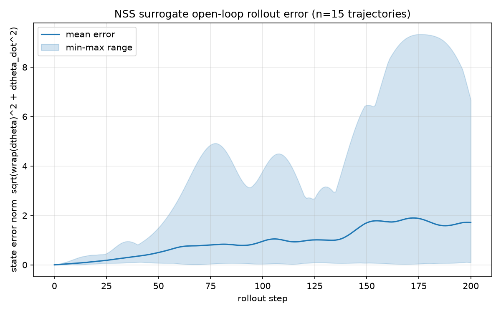
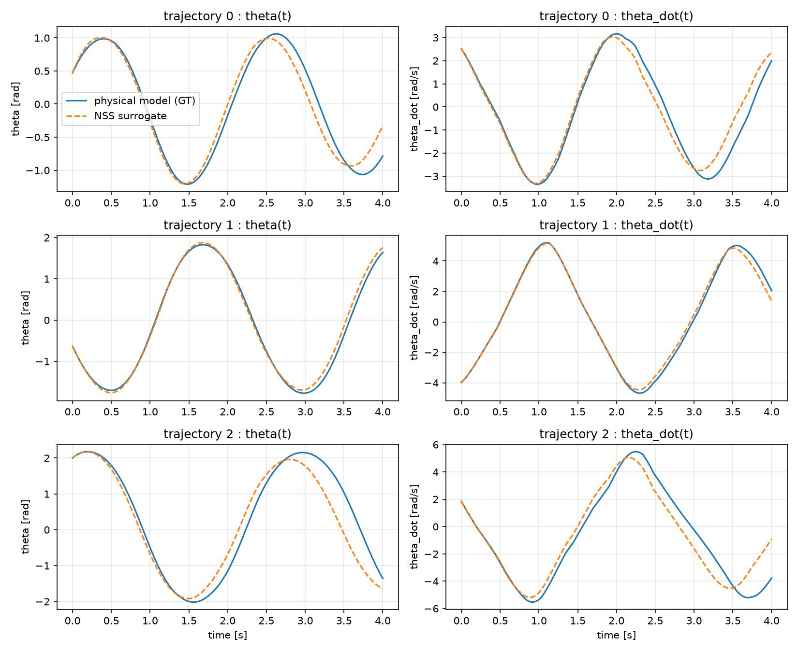
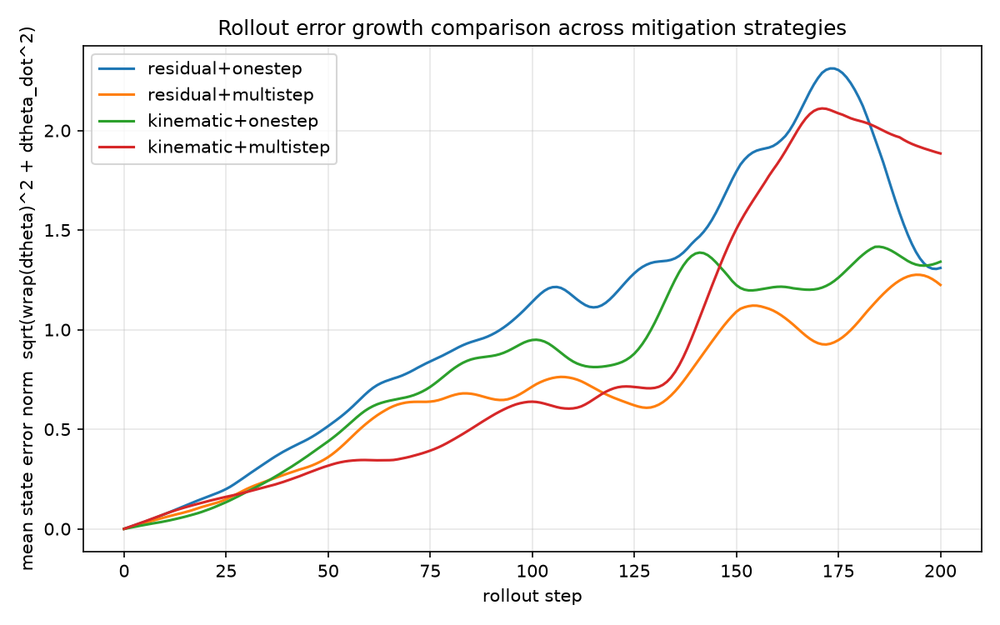
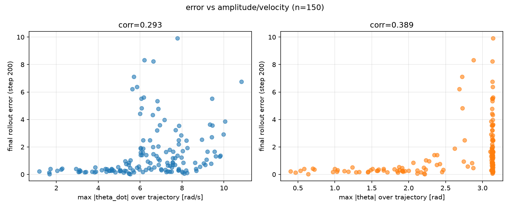
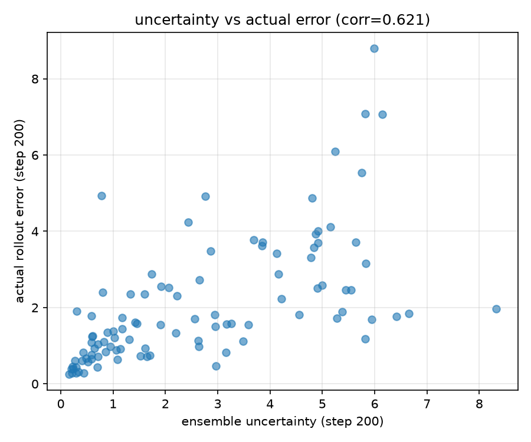
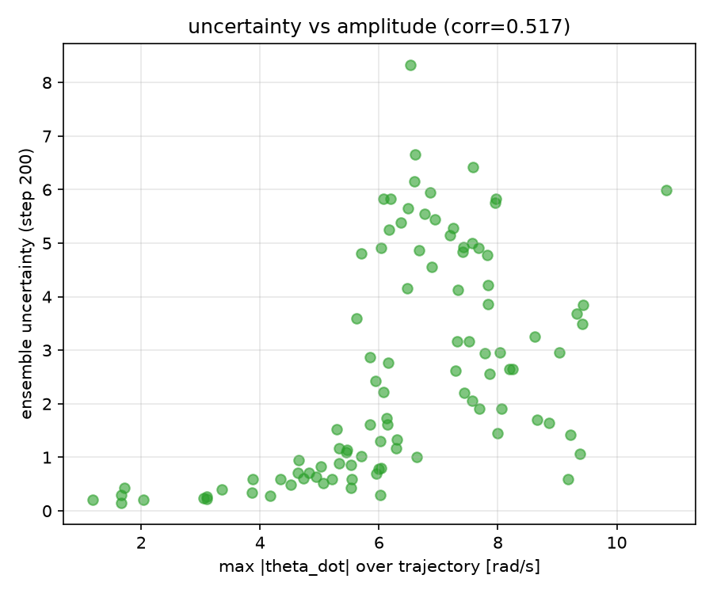

# pendulumSurrogate

単振子(外部トルク入力あり)の物理シミュレータを実装し、Neural State Space (NSS) モデルでサロゲート化した上で、ロールアウト時の誤差蓄積とその対策を検証するプロジェクト。

## ディレクトリ構成

```
pendulumSurrogate/
  src/pendulum/
    simulator.py    # 物理モデル(RK4積分器, トルク入力あり単振子)
    dataset.py       # 学習用データセット生成(1-step / マルチステップ)
    models.py        # NSSモデル(残差形式 / 運動学的制約付き)
    train.py          # 学習(1-step / マルチステップ・ロールアウト損失)
    evaluate.py       # ロールアウト誤差評価・可視化・診断
    ensemble.py       # アンサンブルによる不確実性推定
  scripts/
    run_experiment.py # データ生成→学習→評価→診断を実行するCLI
    compare_runs.py    # 複数実験のロールアウト誤差成長カーブを比較
    run_ensemble.py     # アンサンブル学習・不確実性評価を実行するCLI
  docs/               # 各Issueの結果プロット(参照用)
  outputs/            # 学習済みモデル・プロットの出力先(gitignore対象)
```

## セットアップ・実行

```bash
python3 -m venv .venv && source .venv/bin/activate
pip install -r requirements.txt

# 1モデルの学習・評価・時系列比較を一括実行
python scripts/run_experiment.py all \
  --model-type residual --training-mode multistep \
  --output-dir outputs/residual_multistep

# 複数実験のロールアウト誤差成長カーブを比較
python scripts/compare_runs.py \
  --run "residual+onestep=outputs/residual_onestep" \
  --run "residual+multistep=outputs/residual_multistep" \
  --output outputs/comparison.png

# アンサンブルによる不確実性推定
python scripts/run_ensemble.py all --output-dir outputs/ensemble_residual_multistep
```

`model_type`(`residual` / `kinematic`) と `training_mode`(`onestep` / `multistep`)の組み合わせを切り替えて学習・比較できる。

## 結果と結論

### 1. ロールアウト誤差蓄積の確認 ([#1](https://github.com/yk142/pendulumSarrogate/issues/1))

1-step予測は非常に高精度(val MSE ≈ 1.4e-5)だが、学習済みモデルを自己回帰的にロールアウトすると誤差が蓄積し、2周期目以降に位相ずれが顕著化して発散することを確認した。




### 2. 誤差蓄積対策の比較 ([#2](https://github.com/yk142/pendulumSarrogate/issues/2))

以下2つの対策を実装し比較した:

- **マルチステップ/ロールアウト損失**: 学習時にNステップ先まで自己回帰的に予測し誤差を逆伝播するカリキュラム学習(horizon 1→2→5→10→20)
- **運動学的制約付きモデル(Kinematic NSS)**: `dtheta/dt = theta_dot`という常に厳密に成り立つ関係を構造に組み込み、NNはtheta_dotのダイナミクスのみ学習

| 手法 | 最終ロールアウト誤差(平均) |
|---|---|
| residual + onestep (baseline) | 1.310 |
| **residual + multistep** | **1.225**(最良) |
| kinematic + onestep | 1.341 |
| kinematic + multistep | 1.885 |



**結論**: マルチステップ/ロールアウト損失が最も効果的。運動学的制約は短期精度は最良だが、長期ロールアウトの誤差蓄積抑制効果は限定的だった。

### 3. 誤差蓄積の根本原因診断 ([#4](https://github.com/yk142/pendulumSarrogate/issues/4))

誤差と軌道の振幅・角速度の相関を定量化した結果、誤差は**振り子が頂点を超えるかどうかの臨界角速度(セパラトリクス) `sqrt(4g/L) ≈ 6.26 rad/s` 近傍でピークを持つ**ことが、モデルの種類・学習方法によらず共通して確認された。



セパラトリクス近傍を重点的にサンプリングする対策も試したが、学習が不安定化しむしろ性能が悪化するネガティブな結果となった。この領域の誤差蓄積は、力学的にわずかな誤差が質的に異なる挙動(反転 vs 頂点超え)への分岐を生む本質的な感度の高さに起因しており、単純なデータ・学習の工夫では解決しないと結論づけた。

### 4. アンサンブルによる不確実性推定 ([#6](https://github.com/yk142/pendulumSarrogate/issues/6))

予測精度自体の改善が難しい領域があることを踏まえ、異なるシードで学習した5モデルのアンサンブルによる予測ばらつきを不確実性指標として評価した。




- アンサンブル不確実性と実誤差の相関: **0.621**(振幅ベース指標の0.29〜0.56より強力)
- 不確実性はセパラトリクス近傍(6〜8 rad/s)で明確にピーク(#4の診断と整合)

**結論**: 予測精度そのものは改善しないが、ground truthなしに「いつ予測が信頼できないか」をモデル自身の予測ばらつきから検知できることを確認した。

## 総括

- ロールアウト誤差蓄積には、**学習方法の工夫で緩和できるもの**(マルチステップ/ロールアウト損失が有効)と、**力学的に本質的で緩和が困難なもの**(セパラトリクス近傍の感度)の二種類が混在している
- 後者に対しては予測精度の追求よりも、アンサンブル不確実性推定による検知・警告が実用上有効な対応策となる
